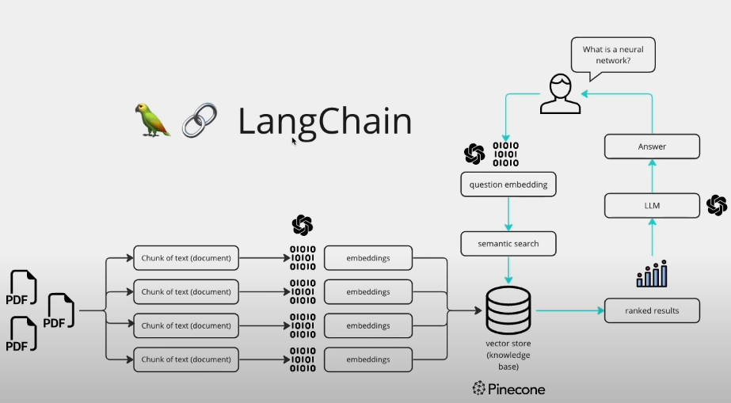

# Chat With PDF

The goal of the project is to ask any content present in the PDF. We can upload multiple Pdf and ask anything related to the pdf.
# workFlow


#Step
Step To Run Locally...

Step1> Clone this repo
        ```bash
        https://github.com/prasantpoudel/LLMs_PDF_Chat_Bot.git
        ```

Step2 > Download all the requrements files
        ```bash
        pip install -r requirements.txt
        ```

Step3> Change the .env.example file to .env file.

Step4> Add all the api of the OpenAI if you are using OpenAI Embedding.
        Also you can use the Hugging face Api.
        (OpenAi Embdedding are costly and can give the timeouterror if you are using free api)
        (HuggingFace api are free but slower to process the text)

Step5> Run the main file
        ```bash
        Streamlit run main.py
        ```
